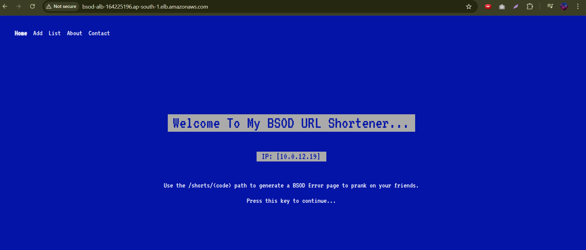
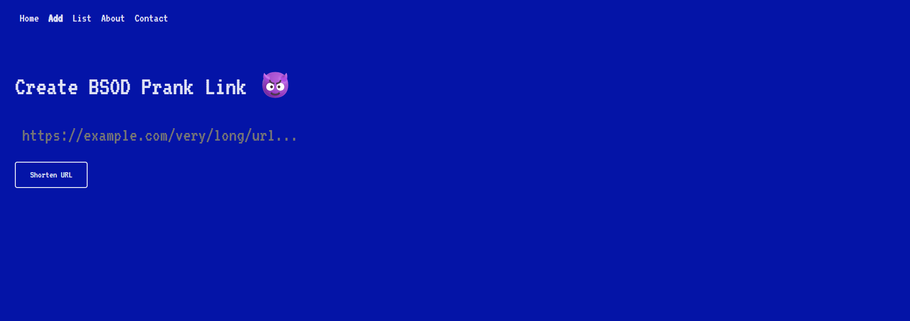
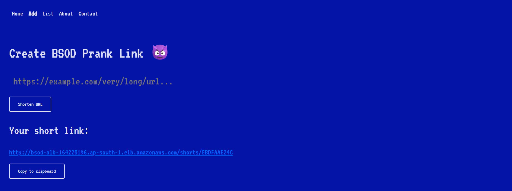
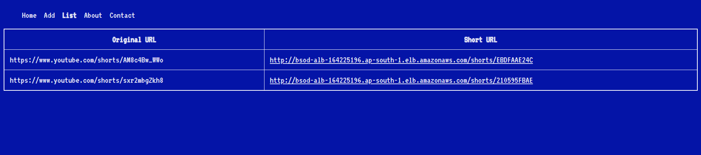
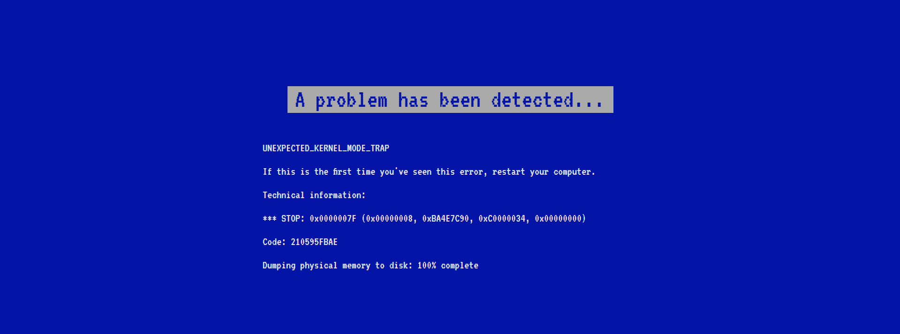
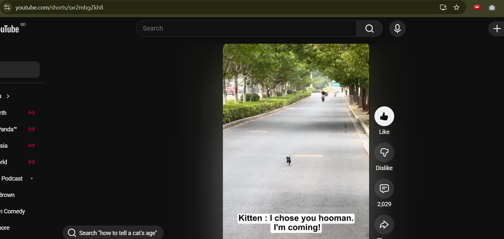
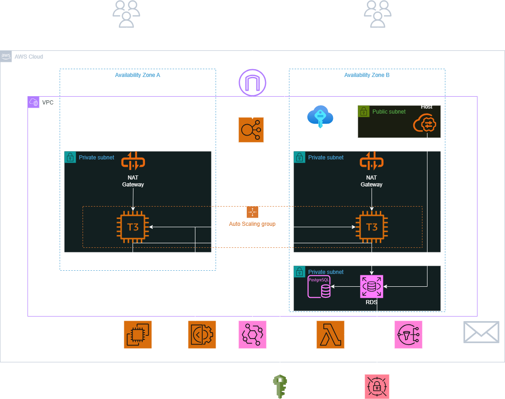

# BSOD Prank URL Shortener 😈💻

[](https://aws.amazon.com/)
[](https://nextjs.org/)
[](https://www.terraform.io/)
[](https://www.postgresql.org/)


A fun and harmless URL shortener built with Next.js that pranks your friends with a realistic fake Windows Blue Screen of Death (BSOD) before redirecting to the actual link. Share shortened links that simulate a system crash with a progress bar, then seamlessly redirect to the original URL (e.g., a cute kitten video).
This project is deployed on AWS using Terraform for infrastructure as code, ensuring scalability, security, and reliability. It's designed for staging environments but can be adapted for production.

## Example Flow:

Visit the home page to create a prank link.
Input a URL (e.g., a YouTube Short).
Get a short link like /shorts/210595FBAE.
Share it—clicking triggers the BSOD prank.
After the "memory dump"(Fake) reaches 100%, redirect to the original content.

#### Screenshots:

**Home Page:**


**Create Prank:**


**Generated Short Link:**


**List of Links:**


**The Prank (Fake BSOD):**


**Redirect Example (YouTube Short):**


## Features:

**URL Shortening with Prank:** Generate short codes for any valid URL; shows fake BSOD with animated progress bar before redirect.
**Customizable BSOD:** Error code matches the short code for realism; fullscreen simulation.
**Link Management:** View list of created links.
**Scalable AWS Backend:** Auto Scaling Group (ASG) with min 2/max 4 instances, CPU-based scaling.
**Secure Database:** PostgreSQL RDS with Secrets Manager for credentials.
**Notifications:** Lambda-triggered emails via SNS for ASG events (launch/terminate).
**Bastion Host:** Optional for secure DB access.
**Sticky Sessions:** Enabled for consistent user experience.
**CI/CD Ready:** User data script pulls latest code from Git, builds, migrates DB, and starts app with PM2. GitHub Actions workflow triggers ASG instance refresh on code pushes.

#### Tech Stack

| Layer             | Technology                                                                 |
|-------------------|----------------------------------------------------------------------------|
| Application       | Next.js 16 (App Router), React 19, Prisma ORM, SASS                        |
| Runtime           | Node.js (latest, pre-installed in custom AMI)                              |
| Process Manager   | PM2                                                                        |
| Database          | PostgreSQL 16 on RDS (db.t3.micro)                                         |
| Infrastructure    | Terraform (IaC)                                                            |
| Compute           | EC2 Auto Scaling Group (t3.small, min 2 / max 4)                           |
| Load Balancing    | Application Load Balancer (ALB)                                            |
| Networking        | Custom VPC with public/private subnets across 3 AZs, NAT Gateways, IGW     |
| Secrets           | AWS Secrets Manager (auto-managed master password)                         |
| Monitoring        | EventBridge → Lambda → SNS (email alerts for ASG events)                   |
| Security          | Least-privilege IAM roles, Security Groups, private RDS                    |

## Architecture Overview:

The app runs on EC2 instances in private subnets, behind an ALB in public subnets. RDS is in a private subnet. Internet access for private resources via NAT Gateways. Bastion for optional SSH/DB access.

#### Diagram:



### Frontend Key Components

- **App Directory (`app/`)**: Contains pages and components for the home page, URL shortening form, link list, and BSOD prank page.
- **Prisma ORM (`prisma/`)**: Manages database schema and interactions with PostgreSQL for storing URL mappings.
- **Public Assets (`public/`)**: Static files like images, fonts, or styles for the BSOD simulation.
- **Styling**: Uses SASS/SCSS for custom BSOD-themed styles (e.g., blue screen effects).
- **Dependencies**: @prisma/client, next, react, react-dom, sass (see package.json for full list).

## Local Development:

**1. Clone the repo:**

```bash
git clone https://github.com/artamim/BSOD-Frontend.git
cd BSOD-Frontend
```

**2. Install dependencies:**

```bash
npm install
```

**3. Set up environment (e.g., .env with DATABASE_URL for Prisma).**

**4. Run development server:**

```bash
npm run dev
```
Open http://localhost:3000 in your browser.

## Deployment Instructions:

**1. Clone Repo And Go Into The Folder:**

```bash
git clone https://github.com/artamim/aws-bsod-prank.git
```

**2. Initialize Terraform:**

```bash
terraform init
```

**3. Review/Customize Variables (in main.tf module block):**

- Update bastion_ssh_cidr to your IP/32 for security.
- Ensure bastion_key_name exists (Or remove it to only rely on EC2 Instance Connect).
- Adjust AZs, instance types as needed.

**4. Apply**
```bash
terraform apply -auto-approve
```

**5. Destroy (cleanup)**
```bash
terraform destroy -auto-approve
```

## CI/CD Pipeline:

This project uses GitHub Actions for continuous deployment. The workflow in the frontend repo (.github/workflows/main.yml) triggers an ASG instance refresh on pushes to the main branch, ensuring new code is deployed without downtime.

#### Workflow Overview:

- **Trigger:** Push to main branch.
- **Permissions:** Uses OIDC for secure AWS authentication (no long-lived credentials).
- **Steps:**
    - Configure AWS credentials by assuming an IAM role 
        (arn:aws:iam::[AWS Account ID]:role/MyGithubRoles).
    - Start a rolling instance refresh on the ASG (BSOD-ASG):
        - Strategy: Rolling (replaces instances one by one).
        - Preferences: Maintain 90% healthy instances, 300s warmup time.
    This works with the EC2 user data script, which pulls the latest code from Git on instance launch, rebuilds the app, applies Prisma migrations, and restarts PM2.

YAML File:

```bash
name: Trigger ASG Instance Refresh
on:
  push:
    branches:
      - main
permissions:
  id-token: write # Required for OIDC
  contents: read # Good default
jobs:
  refresh:
    runs-on: ubuntu-latest
    steps:
      - name: Configure AWS Credentials
        uses: aws-actions/configure-aws-credentials@v4
        with:
          role-to-assume: arn:aws:iam::364420385429:role/MyGithubRoles
          aws-region: ap-south-1
      - name: Start Instance Refresh
        run: |
          aws autoscaling start-instance-refresh \
            --auto-scaling-group-name BSOD-ASG \
            --strategy Rolling \
            --preferences '{
              "MinHealthyPercentage": 90,
              "InstanceWarmup": 300
            }'
```

#### Prerequisites for CI/CD:

- Configure GitHub OIDC trust in AWS IAM for the role.
- Ensure the role has permissions for autoscaling:AutoScalingFullAccess.
- The frontend repo must be cloned on EC2 instances (handled by user data).

## Prerequisites

- AWS Account (free tier eligible for most resources; monitor costs for NAT/ALB).
- Terraform installed (v1.x).
- AWS CLI configured with credentials.
- Git repo with Next.js code at /home/ec2-user/BSOD-Frontend on instances (setup manually or via CI).
- Existing EC2 Key Pair (BSOD-Bastion-Key) in ap-south-1 for bastion.
- Replace email in sns.tf with yours.

**Costs Warning:** RDS, NAT Gateways, and ALB incur charges. Use free tier where possible (e.g., t3.micro). Destroy resources when done.

#### Manual AMI Step (if recreating):

- Launch temporary EC2 (Amazon Linux 2023, t3.micro).
- Install Node.js (latest via nodesource) and Git.
- Create AMI tagged Name: BSOD-Frontend-Base-AMI.
- Terraform data source fetches it.

## How It Works
1. User creates short link via Next.js app (stored in RDS).
2. Shared link hits ALB → ASG instance → Renders BSOD page (JS animation).
3. At 100%, redirects to original URL.
4. ASG scales on CPU; events notify via Lambda/SNS.
5. User data on launch: Waits for RDS, fetches password, builds/migrates/runs app.

## Disclaimer ⚠️
This is a harmless prank for friends who enjoy tech humor. Do not use maliciously, in professional settings, or on vulnerable individuals. No data collection or malware—purely client-side JS prank. Use responsibly!
AWS resources may incur costs; monitor your bill.
Sticky Sessions is necessary for the Add page to work perfectly. Turning it off will change the private IP that can be viewed on the homepage. It can be useful to view the effectiveness of the ALB.

## Have Fun Pranking Your Friends!!
